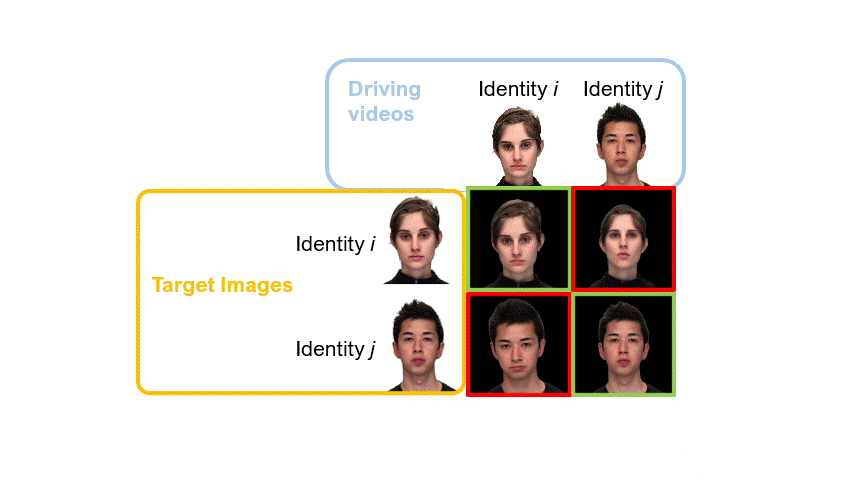
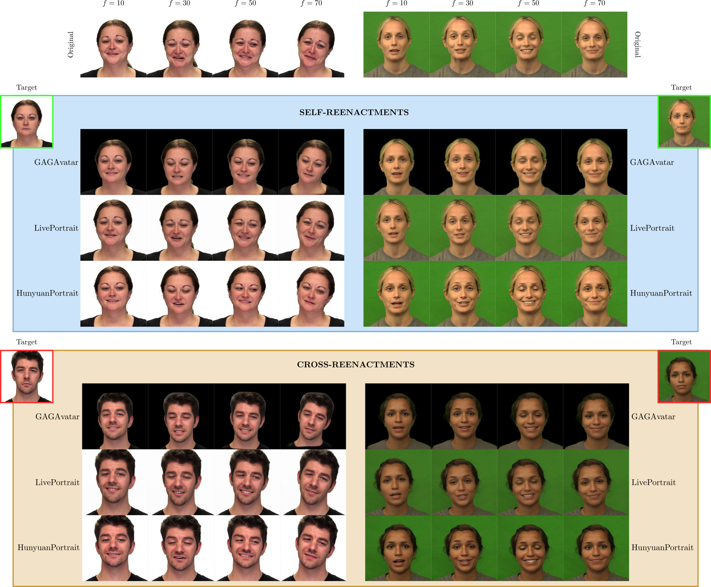

<h1 align="center">
  AVAPrintDB: A Public Multi-Generator Avatar Fingerprinting Database and Benchmark
</h1>


<h3 align="center">
    <a href='https://arxiv.org/pdf/2603.26934'></a> &nbsp; 
    <a href='https://doi.org/10.5281/zenodo.20548978'></a> &nbsp; 
    <a href='https://github.com/BiDAlab/AVAPrintDB'></a> &nbsp; 
</h3>

<h3 align="center">
Official repository for:
<a href="https://arxiv.org/pdf/2603.26934">
    Leveraging Avatar Fingerprinting: A Multi-Generator Photorealistic Talking-Head Public Database and Benchmark
  </a>
</h3>

<h5 align="center">
    <a href="https://scholar.google.com/citations?user=xYLElMkAAAAJ&hl=es">Laura Pedrouzo Rodriguez</a> &emsp;
    <a href="https://scholar.google.com/citations?user=Nq3NyHYAAAAJ&hl=en">Luis F. Gomez</a> &emsp;
    <a href="https://rubentolosana.github.io/">Ruben Tolosana Moranchel</a>  &emsp;<br>
    <a href="https://scholar.google.com/citations?user=KYMQ0tsAAAAJ&hl=es">Ruben Vera Rodriguez</a>  &emsp;
    <a href="https://scholar.google.com/citations?hl=es&user=u0e5cXkAAAAJ">Roberto Daza</a>  &emsp;
    <a href="https://scholar.google.com/citations?user=yRP16B4AAAAJ&hl=es">Aythami Morales</a>  &emsp;
  <a href="https://scholar.google.com/citations?user=HbG_NOoAAAAJ&hl=en">Julian Fierrez</a>  &emsp;
    <br><br>
    Universidad Autónoma de Madrid, UAM
</h5>


<h3 align="center">
    &emsp;   
</h3>


# Quick links
- **Paper:** [arXiv PDF](https://doi.org/10.48550/arXiv.2603.26934)
- **Dataset (Zenodo):** [here](https://doi.org/10.5281/zenodo.20548978)
- **Code:** [Here](./database/preprocessing/) for database preprocessing, and [here](./benchmark/code/) for benchmark experiments.
- **Benchmark Checkpoints:** [Here](./benchmark/checkpoints/)


# Overview

AVAPrintDB is the **first fully public multi-generator avatar fingerprinting resource** combining:

* a large-scale photorealistic talking-head avatar database (**66k+ videos**),
* standardized evaluation protocols,
* publicly available benchmark code,
* pretrained checkpoints,
* preprocessing pipelines,
* and reproducibility resources.

The benchmark spans **three state-of-the-art avatar generators** from distinct synthesis paradigms ([GAGAvatar](https://github.com/xg-chu/GAGAvatar) (Neurips 2024), [LivePortrait](https://github.com/KlingAIResearch/LivePortrait) (2025), and [HunyuanPortrait](https://github.com/Tencent-Hunyuan/HunyuanPortrait) (CVPR 2025)), **two audiovisual source datasets** ([RAVDESS](https://zenodo.org/records/1188976) and [CREMA-D](https://github.com/CheyneyComputerScience/CREMA-D)), and multiple evaluation settings including **generator shift**, **dataset shift**, and **demographic analysis**.

We include <span style="color: green">**genuine**</span> and <span style="color: red">**impostor**</span> videos: 
<table align="center">
  <tr>
    <td></td>
    <td></td>
  </tr>
</table>

# AVAPrintDB Structure

The AVAPrintDB root folder contains these subfolders: 

```
AVAPrintDB
├── assets
├── README.md
├── benchmark
│   ├── checkpoints
│   │   ├── clip-based
│   │   ├── dino-based
│   │   └── graph-based
│   ├── code
│   │   ├── foundational_models
│   │   └── graph_model
│   └── eval_files
└── database
    ├── data
    │   ├── embeddings
    │   │   ├── CLIPFeats
    │   │   └── DINOFeats
    │   ├── landmarks
    │   ├── metadata
    │   └── videos
    ├── generation
    └── preprocessing
        ├── foundational_extraction
        └── landmarks_extraction
```

## Database

### Data

#### [Videos](./database/data/videos/)

In `videos` folder, you can find two subfolders: `DEV` and `TEST`. The `DEV` folder contains all the videos used for development (training and validation), and the `TEST` folder contains all the videos used for evaluation. The split is identity-disjoint, this is, the data was split so that each identity can only be present as driver or target in one of the subsets, either in `DEV` or in `TEST`, i.e. target and driver identities appearing in TEST are unseen during development.

The naming convention used for the video files is:

    <target_id>--<driver_id>--<video_uuid_name>--<generator>.mp4

Where `<target_id>` and `<driver_id>` correspond to the real identities from the source datasets, `<generator>` corresponds to the avatar generator used to generate the avatar (`GAGA` for GAGAvatar, `LIVE` for LivePortrait and `HUNY` for HunyuanPortrait), and `<video_uuid_name>` corresponds to a UUID obtained for each unique source video. The mappings between UUIDs and source videos are reported in the metadata files.

> **Example**
> 
> Avatar video with filename `C1061--C1005--063b1674-e708-5f9c-8f09-2f75f27a31aa--GAGA.mp4`, would correspond to an avatar generated using identity `1061` from CREMA-D as the target (appearance), identity `1005` from CREMA-D as the driver, using GAGAvatar generator with the CREMA-D video corresponding to the UUID `063b1674-e708-5f9c-8f09-2f75f27a31aa`.

#### [Landmarks](./database/data/landmarks/)
In this folder you can find a numpy file for each avatar video file in `videos`. The numpy file contains the selected 109 Mediapipe 3D landmarks for each frame in the video. Files are divided into `DEV` and `TEST` folders containing the landmarks to the corresponding avatar videos.


The code used to generate them is included in the [`preprocessing/landmarks_extraction`](./database/preprocessing/landmarks_extraction/) folder.

#### [Embeddings](./database/data/embeddings/)
In this folder you can find the CLIP and DiNOv2 embeddings obtained for each avatar video file in `videos`.

The code used to generate them is included in the [`preprocessing/foundational_extraction`](./database/preprocessing/foundational_extraction/) folder.


#### [Metadata](./database/data/metadata/)

In this folder you can find these files:
- `avaprintdb_metadata.csv`: this file contains a list of each of the avatar videos in the database, indicating the source data used to generate it, and the split it corresponds to (`DEV`, `TEST`).
- `cremad_metadata.csv`: this file contains a list of all the crema-d videos used as source, with the soft-biometric data corresponding to the identity in the video, and the recording details (statement spoken, resolution, etc.).
- `ravdess_metadata.csv`: this file contains a list of all the ravdess videos used as source, with the soft-biometric data corresponding to the identity in the video, and the recording details (statement spoken, resolution, etc.).


### [Generation](./database/generation/)

This folder contains the information needed to generate the avatar videos from this dataset or the same videos using any other avatar generator. Users can regenerate corresponding avatars using publicly available generator implementations together with the released metadata.

For more details check the [README](./database/generation/README.md).

### [Preprocessing](./database/preprocessing/)

This folder contains the code used to preprocess the avatar videos, i.e. generating the facial landmarks that some models in the benchmark need as inputs, and generating the CLIP and DiNOv2 visual features that other models need as inputs. For more details check the README files in the corresponding folder [here](./database/preprocessing/).


## Benchmark

This folder contains all the files, information and code needed to replicate the experiments in the benchmark to evaluate avatar fingerprinting models.

### Benchmark Scenarios

The benchmark studies robustness under different domain conditions.

| Scenario | Training | Evaluation | Goal |
|-----------|-----------|------------|------|
| Intra-dataset / Intra-generator | Same dataset | Same dataset | Matched setting |
| Intra-dataset / Cross-generator | Same dataset | Different generator | Generator robustness |
| Cross-dataset / Intra-generator | Different dataset | Same generator | Dataset robustness |

These scenarios are designed to analyze whether avatar fingerprinting systems learn robust identity-dependent motion cues or overfit to dataset- or generator-specific artifacts.

### [Checkpoints](./benchmark/checkpoints/)

This folder contains the released pretrained checkpoints for each of the models trained for the benchmark. They are grouped by verification model. They are named following this pattern:

    checkpoint_<model>_trained_<source_dataset>_<avatar_generator>.pt

Where `model` can be `graph`, `dino` or `clip`, and it indicates the model corresponding to this checkpoint. `<source_dataset>`can be either `ravdess` or `cremad` and it indicates the source dataset used to generate the training avatars for this checkpoint. `<avatar_generator>` can be `gagavatar`, `hunyuan` or `liveportrait`, and it indicates the avatar generator used to generate the training avatars.

### [Code](./benchmark/code/)

This folder contains the code used for training and evaluation. For more details check the [README](./benchmark/code/README.md).


### [Evaluation files](./benchmark/eval_files/)

In this folder you can find one csv file per avatar generator and source dataset. Each csv file contains the pairs of "enrolment video" and "test video" with the corresponding label (1 if both correspond to the same driving identity, 0 if they don't). These are the evaluation files used for the benchmark.

# Benchmark Results

<details>
<summary>Click to expand</summary>

## Intra-dataset, intra-generator results

Results are reported as **AUC (%)** with the corresponding **95% confidence interval** obtained through bootstrap resampling.

| Dataset | Generator | Graph | DINOv2 | CLIP | Fusion |
|---|---|---:|---:|---:|---:|
| CREMA-D | GAGA | 87.8 [87.7, 88.0] | 87.0 [86.9, 87.2] | 86.4 [86.2, 86.5] | **93.8** **[93.7, 93.9]** |
| CREMA-D | LIVE | 90.8 [90.7, 91.0] | 88.8 [88.7, 89.0] | 88.6 [88.5, 88.8] | **95.2** **[95.1, 95.3]** |
| CREMA-D | HUNY | 82.6 [82.5, 82.8] | 79.8 [79.6, 80.0] | 81.0 [80.8, 81.2] | **87.6** **[87.4, 87.7]** |
|  |  |  |  |
| RAVDESS | GAGA | 75.7 [75.3, 76.0] | 75.9 [75.6, 76.2] | 76.0 [75.7, 76.3] | **83.0** **[82.7, 83.3]** |
| RAVDESS | LIVE | 76.5 [76.1, 76.8] | 67.2 [66.8, 67.6] | 70.2 [69.8, 70.6] | **79.4** **[79.1, 79.8]** |
| RAVDESS | HUNY | 72.3 [71.9, 72.6] | 74.0 [73.7, 74.4] | 77.0 [76.7, 77.4] | **78.8** **[78.5, 79.2]** |
|  |  |  |  |
|  |  |  |  |

## Cross-dataset, intra-generator results

Each cell reports **AUC_ref → AUC_cross** on the first line and **ΔAUC [95% CI]** on the second line. AUC values are expressed in %, while ΔAUC and confidence intervals are expressed in percentage points.

| Dataset shift | Generator | Graph | DINOv2 | CLIP | Fusion |
|---|---|---:|---:|---:|---:|
| CREMA-D → RAVDESS | GAGA | **87.8** → 77.3<br>Δ -10.5 [-10.9, -10.1] | **87.0** → 79.5<br>Δ -7.6 [-7.9, -7.2] | **86.4** → 77.3<br>Δ -9.1 [-9.4, -8.7] | **93.8** → 84.2<br>Δ -9.6 [-9.9, -9.3] |
| CREMA-D → RAVDESS | LIVE | **90.8** → 69.2<br>Δ -21.6 [-22.0, -21.2] | **88.8** → 66.9<br>Δ -21.9 [-22.3, -21.5] | **88.6** → 59.7<br>Δ -28.9 [-29.3, -28.4] | **95.2** → 67.5<br>Δ -27.7 [-28.1, -27.3] |
| CREMA-D → RAVDESS | HUNY | **82.6** → 74.4<br>Δ -8.2 [-8.6, -7.8] | **79.8** → 72.6<br>Δ -7.2 [-7.6, -6.8] | **81.0** → 75.6<br>Δ -5.4 [-5.8, -5.1] | **87.6** → 77.7<br>Δ -9.9 [-10.2, -9.5] |
|  |  |  |  |
| RAVDESS → CREMA-D | GAGA | **75.7** → 83.5<br>Δ +7.9 [+7.5, +8.3] | **75.9** → 80.9<br>Δ +5.0 [+4.6, +5.4] | **76.0** → 79.4<br>Δ +3.4 [+3.0, +3.7] | **83.0** → 89.3<br>Δ +6.3 [+6.0, +6.7] |
| RAVDESS → CREMA-D | LIVE | **76.5** → 82.8<br>Δ +6.3 [+5.9, +6.7] | **67.2** → 71.5<br>Δ +4.3 [+3.8, +4.8] | **70.2** → 76.4<br>Δ +6.2 [+5.8, +6.6] | **79.4** → 84.7<br>Δ +5.3 [+4.9, +5.7] |
| RAVDESS → CREMA-D | HUNY | **72.3** → 77.9<br>Δ +5.6 [+5.2, +6.0] | **74.0** → 72.2<br>Δ -1.8 [-2.3, -1.4] | **77.0** → 76.6<br>Δ -0.4 [-0.8, -0.1] | **78.8** → 83.1<br>Δ +4.3 [+3.9, +4.7] |
|  |  |  |  |
|  |  |  |  |


## Intra-dataset, cross-generator results

Each row compares an **intra-generator reference** against a **cross-generator evaluation**. Each model cell reports **AUC_ref → AUC_cross** on the first line and **ΔAUC [95% CI]** on the second line. AUC values are expressed in %, while ΔAUC and confidence intervals are expressed in percentage points.

### CREMA-D

| Reference | Cross-generator | Graph | DINOv2 | CLIP | Fusion |
|---|---|---:|---:|---:|---:|
| GAGA → GAGA | GAGA → LIVE | **87.8** → 84.6<br>Δ -3.2 [-3.4, -2.9] | **87.0** → 68.9<br>Δ -18.2 [-18.5, -17.9] | **86.4** → 75.8<br>Δ -10.6 [-10.9, -10.3] | **93.8** → 86.1<br>Δ -7.8 [-8.0, -7.6] |
| GAGA → GAGA | GAGA → HUNY | **87.8** → 84.4<br>Δ -3.4 [-3.6, -3.2] | **87.0** → 66.7<br>Δ -20.4 [-20.6, -20.1] | **86.4** → 71.8<br>Δ -14.6 [-14.8, -14.3] | **93.8** → 85.4<br>Δ -8.4 [-8.6, -8.2] |
|  |  |  |  |
| LIVE → LIVE | LIVE → GAGA | **90.8** → 76.5<br>Δ -14.3 [-14.5, -14.0] | **88.8** → 69.9<br>Δ -18.9 [-19.2, -18.6] | **88.6** → 71.3<br>Δ -17.3 [-17.6, -17.1] | **95.2** → 78.4<br>Δ -16.8 [-17.1, -16.6] |
| LIVE → LIVE | LIVE → HUNY | **90.8** → 73.9<br>Δ -16.9 [-17.1, -16.6] | **88.8** → 74.2<br>Δ -14.6 [-14.9, -14.4] | **88.6** → 73.7<br>Δ -15.0 [-15.2, -14.7] | **95.2** → 79.3<br>Δ -15.9 [-16.1, -15.7] |
|  |  |  |  |
| HUNY → HUNY | HUNY → GAGA | **82.6** → 84.8<br>Δ +2.2 [+2.0, +2.5] | **79.8** → 63.5<br>Δ -16.3 [-16.6, -16.0] | **81.0** → 72.1<br>Δ -8.9 [-9.2, -8.6] | **87.6** → 79.1<br>Δ -8.5 [-8.7, -8.2] |
| HUNY → HUNY | HUNY → LIVE | **82.6** → 84.5<br>Δ +1.9 [+1.6, +2.1] | **79.8** → 79.8<br>Δ 0.0 [-0.3, +0.3] | **81.0** → 75.2<br>Δ -5.8 [-6.1, -5.5] | **87.6** → 86.7<br>Δ -0.9 [-1.1, -0.7] |
|  |  |  |  |
|  |  |  |  |

### RAVDESS

| Reference | Cross-generator | Graph | DINOv2 | CLIP | Fusion |
|---|---|---:|---:|---:|---:|
| GAGA → GAGA | GAGA → LIVE | **75.7** → 66.7<br>Δ -8.9 [-9.5, -8.4] | **75.9** → 64.7<br>Δ -11.2 [-11.7, -10.7] | **76.0** → 65.5<br>Δ -10.5 [-11.0, -9.9] | **83.0** → 70.4<br>Δ -12.6 [-13.1, -12.1] |
| GAGA → GAGA | GAGA → HUNY | **75.7** → 73.1<br>Δ -2.6 [-3.1, -2.1] | **75.9** → 62.2<br>Δ -13.7 [-14.2, -13.1] | **76.0** → 65.3<br>Δ -10.8 [-11.3, -10.2] | **83.0** → 71.5<br>Δ -11.5 [-12.0, -11.0] |
|  |  |  |  |
| LIVE → LIVE | LIVE → GAGA | **76.5** → 69.0<br>Δ -7.4 [-8.0, -7.0] | **67.2** → 65.4<br>Δ -1.8 [-2.4, -1.3] | **70.2** → 62.9<br>Δ -7.3 [-7.8, -6.7] | **79.4** → 69.4<br>Δ -10.1 [-10.6, -9.6] |
| LIVE → LIVE | LIVE → HUNY | **76.5** → 69.1<br>Δ -7.4 [-8.0, -6.9] | **67.2** → 63.2<br>Δ -4.0 [-4.6, -3.4] | **70.2** → 65.8<br>Δ -4.3 [-4.9, -3.8] | **79.4** → 67.5<br>Δ -11.9 [-12.3, -11.4] |
|  |  |  |  |
| HUNY → HUNY | HUNY → GAGA | **72.3** → 70.4<br>Δ -1.9 [-2.4, -1.4] | **74.0** → 63.8<br>Δ -10.2 [-10.7, -9.6] | **77.0** → 67.1<br>Δ -9.9 [-10.4, -9.4] | **78.8** → 73.0<br>Δ -5.8 [-6.3, -5.4] |
| HUNY → HUNY | HUNY → LIVE | **72.3** → 68.1<br>Δ -4.1 [-4.6, -3.6] | **74.0** → 67.5<br>Δ -6.5 [-7.0, -6.0] | **77.0** → 69.5<br>Δ -7.5 [-8.0, -7.0] | **78.8** → 74.5<br>Δ -4.3 [-4.8, -3.8] |
|  |  |  |  |
|  |  |  |  |


## Fairness summary

Each cell reports the **mean AUC across the subgroups** of a given soft-biometric, followed by the **worst-performing subgroup** and the **performance gap** between the best and worst subgroup:

```text
mean AUC
worst subgroup (gap)
```

Lower gaps indicate more stable performance across subgroups.

### CREMA-D avatars

| Soft-biometric | Generator | Graph | DINOv2 | CLIP | Fusion |
|---|---|---:|---:|---:|---:|
| Gender | GAGA | 88.3 <br> Male (0.9) | 87.0 <br> Male (3.1) | 86.6 <br> Female (2.2) | 94.2 <br> Male (1.3) |
| Gender | LIVE | 91.2 <br> Female (2.5) | 89.0 <br> Female (9.2) | 89.3 <br> Female (4.9) | 95.5 <br> Female (2.6) |
| Gender | HUNY | 83.2 <br> Male (5.5) | 80.2 <br> Female (8.0) | 81.0 <br> Female (5.1) | 87.8 <br> Male (1.8) |
|  |  |  |  |
| Ethnicity | GAGA | 87.4 <br> Asian (5.1) | 87.1 <br> African American (5.9) | 87.4 <br> African American (10.4) | 93.8 <br> African American (3.5) |
| Ethnicity | LIVE | 90.2 <br> Hispanic (4.8) | 88.2 <br> Hispanic (6.7) | 89.2 <br> African American (2.6) | 94.8 <br> Hispanic (5.0) |
| Ethnicity | HUNY | 81.1 <br> Asian (9.3) | 79.2 <br> Hispanic (9.6) | 80.9 <br> Asian (9.8) | 86.5 <br> Hispanic (6.5) |
|  |  |  |  |
| Age | GAGA | 82.6 <br> 46–60 (19.6) | 83.0 <br> 46–60 (16.9) | 85.3 <br> 46–60 (5.3) | 90.3 <br> 46–60 (13.0) |
| Age | LIVE | 88.8 <br> 46–60 (7.4) | 90.8 <br> 20–30 (8.0) | 89.6 <br> 20–30 (5.7) | 95.5 <br> 31–45 (0.9) |
| Age | HUNY | 81.0 <br> 46–60 (8.3) | 80.5 <br> 20–30 (2.2) | 77.9 <br> 46–60 (13.8) | 85.7 <br> 46–60 (8.4) |
|  |  |  |  |
|  |  |  |  |

### RAVDESS avatars

| Soft-biometric | Generator | Graph | DINOv2 | CLIP | Fusion |
|---|---|---:|---:|---:|---:|
| Gender | GAGA | 75.6 <br> Male (5.3) | 76.0 <br> Female (6.3) | 76.7 <br> Male (3.5) | 83.0 <br> Male (1.2) |
| Gender | LIVE | 76.5 <br> Male (11.3) | 67.5 <br> Male (8.9) | 72.4 <br> Male (8.0) | 79.3 <br> Male (11.3) |
| Gender | HUNY | 73.4 <br> Male (5.4) | 74.0 <br> Female (4.2) | 77.1 <br> Male (8.1) | 79.4 <br> Male (3.2) |
|  |  |  |  |
| Ethnicity | GAGA | 78.4 <br> Caucasian (9.8) | 77.8 <br> Caucasian (6.5) | 79.5 <br> Caucasian (10.7) | 86.7 <br> Caucasian (11.3) |
| Ethnicity | LIVE | 80.7 <br> Caucasian (15.8) | 66.4 <br> Asian (4.1) | 68.3 <br> Asian (7.4) | 82.2 <br> Caucasian (10.1) |
| Ethnicity | HUNY | 74.7 <br> Caucasian (8.6) | 78.6 <br> Caucasian (12.7) | 78.0 <br> Asian (0.9) | 81.0 <br> Caucasian (7.6) |
|  |  |  |  |
| Age | GAGA | 76.0 <br> 20–30 (0.6) | 80.2 <br> 20–30 (9.8) | 71.4 <br> 31–45 (12.7) | 82.9 <br> 31–45 (0.6) |
| Age | LIVE | 70.0 <br> 31–45 (17.3) | 66.0 <br> 31–45 (3.8) | 73.7 <br> 20–30 (6.7) | 74.5 <br> 31–45 (12.7) |
| Age | HUNY | 71.6 <br> 31–45 (2.7) | 77.5 <br> 20–30 (8.2) | 81.6 <br> 20–30 (7.8) | 81.6 <br> 20–30 (5.3) |
|  |  |  |  |
|  |  |  |  |

</details>

# Computational Resources

We have used a machine with the following specifications to generate the avatars, preprocess the videos, and run the experiments from the benchmark:

- OS: Ubuntu 24.04.2 LTS
- CPUs: 112 x Intel(R) Xeon(R) Gold 5420+
- RAM: 1 TB
- GPU: 4 x NVIDIA H100 NVL (96 GB Memory), CUDA 12.8


# Citation
```bibtex
@article{pedrouzo2026leveraging,
  title={Leveraging Avatar Fingerprinting: A Multi-Generator Photorealistic Talking-Head Public Database and Benchmark},
  author={Pedrouzo-Rodriguez, Laura and Gomez, Luis F and Tolosana, Ruben and Vera-Rodriguez, Ruben and Daza, Roberto and Morales, Aythami and Fierrez, Julian},
  journal={arXiv preprint arXiv:2603.26934},
  year={2026}
}
```


# License

**AVAPrintDB** contains derivative resources generated from publicly available datasets. We release it under **CC-BY** license.

Users must additionally comply with the original licenses / usage terms of CREMA-D and RAVDESS.

The benchmark **code** is released under **MIT License**.


# Acknowledgements

This project has been developed at **Universidad Autónoma de Madrid** (Spain), supported by **PowerAI+** (SI4/PJI/2024-00062 Comunidad de Madrid and UAM), **Cátedra ENIA UAM-Veridas en IA Responsable** (NextGenerationEU PRTR TSI-100927-2023-2), and **TRUST-ID** (PID2025-173396OB-I00 MICIU/AEI and the EU).


# Contact

For more information contact Rubén Tolosana, associate professor at UAM at **[ruben.tolosana@uam.es](mailto:ruben.tolosana@uam.es)** or Laura Pedrouzo, PhD student at **[laura.pedrouzo@uam.es](mailto:laura.pedrouzo@uam.es)**


