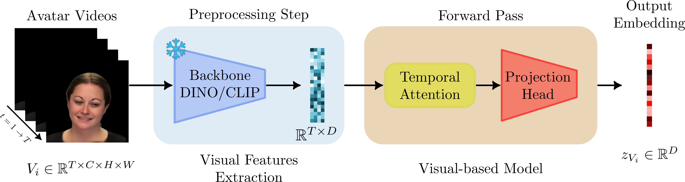
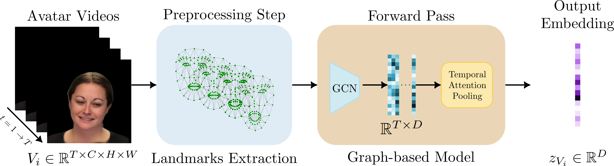

# Benchmark code

This directory contains the code to train and evaluate the systems from the proposed benchmark.


## Setting up the environment

```bash
# Create a python environment
conda create -n avatar_fingerprinting python=3.12

# Activate it
conda activate avatar_fingerprinting

# and install the packages from `requirements.txt`:
pip install -r requirements.txt
```

CUDA version used was 12.8.

## Foundation-based models

We use public Foundational Models and attention-based neural networks for avatar fingerprinting. Foundation Models provide a complementary perspective, analyzing whether general-purpose visual representations can capture behavioral biometric cues in avatar videos. Concretely, we use [DINOv2](https://openreview.net/forum?id=a68SUt6zFt) and [CLIP](https://arxiv.org/abs/2103.00020) as frame-level feature extractors. Figure below provides a graphical representation of the proposed avatar fingerprinting system. 

With an input video $V_i \in \mathbb{R}^{T\times C\times H\times W}$ where $T$ is the number of frames, $C$ is the number of channels for each frame (RGB), $H$ is the height of the frame and $W$ is the width of the frame the backbone generates a sequence of descriptors $X_i \in \mathbb{R}^{T\times D}$, where $D$ is the embedding dimension specified by either DINOv2 or CLIP. 

In addition to the features, we also propose a multi-head temporal attention module. This module can assign importance weights over time and compress the sequence into a single global representation, $\hat{Z_i} \in \mathbb{R}^{D}$. The resulting descriptor is subsequently projected into a compact latent space, $z_{Vi} \in \mathbb{R}^{d}$.

### Architecture details



### Preprocessing
The preprocessing step, include the embedding extraction using the foundational models DINOv2 or CLIP. For more information can check the preprocessing module [here](../../database/preprocessing/foundational_extraction/README.md)

### Pretrained Models


We provide pretrained checkpoints so facilitate reproducibility of our benchmark results. In this table you can find each of the checkpoints, based on the data used to trained the graph-based model, e.g. CREMA-D / GAGA row means that the model was trained only using avatars generated with GAGAvatar using CREMA-D videos and target identities as the source.


| Foundation Model | Source Dataset| Generator | Checkpoint |
|---|---|---|---|
| CLIP | CREMA-D | GAGA | [checkpoint](../checkpoints/clip-based/checkpoint_clip_trained_cremad_gagavatar.pt) |
| CLIP | CREMA-D | LIVE | [checkpoint](../checkpoints/clip-based/checkpoint_clip_trained_cremad_liveportrait.pt) |
| CLIP | CREMA-D | HUNY | [checkpoint](../checkpoints/clip-based/checkpoint_clip_trained_cremad_hunyuan.pt) |
| CLIP | RAVDESS | GAGA | [checkpoint](../checkpoints/clip-based/checkpoint_clip_trained_ravdess_gagavatar.pt) |
| CLIP | RAVDESS | LIVE | [checkpoint](../checkpoints/clip-based/checkpoint_clip_trained_ravdess_liveportrait.pt) |
| CLIP | RAVDESS | HUNY |[checkpoint](../checkpoints/clip-based/checkpoint_clip_trained_ravdess_hunyuan.pt) |
|||||||||
| DINOv2 | CREMA-D | GAGA | [checkpoint](../checkpoints/dino-based/checkpoint_dino_trained_cremad_gagavatar.pt) |
| DINOv2 | CREMA-D | LIVE | [checkpoint](../checkpoints/dino-based/checkpoint_dino_trained_cremad_liveportrait.pt) |
| DINOv2 | CREMA-D | HUNY | [checkpoint](../checkpoints/dino-based/checkpoint_dino_trained_cremad_hunyuan.pt) |
| DINOv2 | RAVDESS | GAGA | [checkpoint](../checkpoints/dino-based/checkpoint_dino_trained_ravdess_gagavatar.pt) |
| DINOv2 | RAVDESS | LIVE | [checkpoint](../checkpoints/dino-based/checkpoint_dino_trained_ravdess_liveportrait.pt) |
| DINOv2 | RAVDESS | HUNY |[checkpoint](../checkpoints/dino-based/checkpoint_dino_trained_ravdess_hunyuan.pt) |
|||||||||


### Training

#### How to run the code?
The main script for training is [`cli.py`](benchmark/code/foundational_models/default_config.yaml). It runs on a single GPU.

```bash
# Activate the conda environment. 
conda activate avatar_fingerprinting

# Run the script with the selected configuration parameters, for instance:
CUDA_VISIBLE_DEVICES=0 python benchmark/code/foundational_models/cli.py   --config_file CONFIG_FILE --mode train --maxframes {int MAXFRAMES} --features {CLIP,DINO} --ktriplets {int KTRIPLETS} --traindataSize {int TRAINDATASIZE}
                        
# You can see all the available configuration parameters and their defaulr values:
python benchmark/code/foundational_models/cli.py --help
```

When running the training script, a directory will be generated in `outputs_FoundationalModels/default_config*`, and it will contain:
- Folder with best checkpoints
- Loss curves in a png file
- Loss values per iteration in a csv file
- Text file where all the configuration parameters used are reported, for reproducibility
- All the scores, ROC curves, and DET curves for the evaluation set.


#### Configuration used

The configuration used for training corresponds to the script's default values, unless otherwise stated. The table below summarizes the main parameters used in the benchmark experiments. Machine-dependent parameters, such as file paths and the number of data-loading workers, are omitted. All configuration files are available [here](foundational_models/default_config.yaml).

| Parameter | Description | Value |
|---|---|---|
| `datasets` | Source datasets considered during training | `CREMA-D` or `RAVDESS` |
| `generators` | Avatar generators considered during training | `GAGA`, `LIVE`, or `HUNY` |
| `max-frames` | Maximum number of frames considered from each video | `60` |
| `ktriplets` | Number of positive and negative samples considered for each anchor | `6` |
| `architecture` | Temporal model used to aggregate frame-level features | `TemporalAttentionPoolingModelNew` |
| `project-dim` | Dimension of the projected representation | `32` |
| `output-dim` | Dimension of the output embedding | `16` |
| `num-heads` | Number of attention heads | `2` |
| `num-layers` | Number of model layers | `2` |
| `optimizer` | Optimization algorithm | `Adam` |
| `lr` | Learning rate | `0.0001` |
| `weight-decay` | Weight-decay coefficient | `0.00005` |
| `batch-size` | Training batch size | `32` |
| `n-epochs` | Maximum number of training epochs | `100` |
| `validation-frequency` | Number of epochs between validation runs | `5` |

We always use Adam Optimizer, with weight decay 1e-5 and a lr scheduler to reduce lr to a tenth after 100 epochs.


### Evaluating

#### How to run the code?

The main script for evaluation is [`cli.py`](benchmark/code/foundational_models/default_config.yaml). It runs on a single GPU. The difference between train and test is the variable mode.

```bash
# Activate the conda environment. 
conda activate avatar_fingerprinting

# Run the script with the selected configuration parameters, for instance:
CUDA_VISIBLE_DEVICES=0 python benchmark/code/foundational_models/cli.py   --config_file CONFIG_FILE --mode test --maxframes {int MAXFRAMES} --features {CLIP,DINO} --ktriplets {int KTRIPLETS} --traindataSize {int TRAINDATASIZE}
                        
# You can see all the available configuration parameters and their defaulr values:
python benchmark/code/foundational_models/cli.py --help
```

When running the evaluation script, a directory will be generated in `$outputs_FoundationalModels/test*`, and it will contain:
- Loss curves in a png file
- Loss values per iteration in a csv file
- Text file where all the configuration parameters used are reported, for reproducibility
- All the scores, ROC curves, and DET curves for the evaluation set.

#### Configuration used

The configuration used for evaluation corresponds to the script's default values, unless otherwise stated. We report in this table below the configuration parameters that we used for our experiments in the benchmark. 
All configuration files are available [here](foundational_models/default_config.yaml).

| Parameter | Description | Value |
|---|---|---|
| `batch-size` | Batch size used during evaluation | `32` |
| `dataset-class` | Dataset class used for evaluation | `EvalDatasetFeatsWindows` |
| `evaluation-pairs-csv` | CSV file containing the evaluation pairs | `benchmark/eval_files/evaluation_pairs_CREMA-D_GAGA.csv` others CSVs can be used |
| `checkpoint` | Path to the model checkpoint used when running in `test` mode | `benchmark/checkpoints/dino-based/checkpoint_dino_trained_cremad_gagavatar.pt` |


## Graph-based model

In [this directory](./graph_model/) you can find the implementation of the IJCB 2025 paper ["Is it Really You?" Exploring Biometric Verification Scenarios in Photorealistic Talking-Head Avatar Videos](
https://doi.org/10.1109/IJCB65343.2025.11411089). We used the official implementation from [here](https://github.com/BiDAlab/GAGAvatar-Benchmark) and made some small changes to improve reproducibility and clarity.

### Architecture Details

It consists of a GCN with three graph convolutional layers (with dropout probability of 0.3 and relu activations), followed by a temporal attention pooling. 



### Preprocessing

The graph-based model takes facial landmarks as inputs, not raw videos. You can use our preprocessed landmarks from [here](../../database/data/landmarks/) or you can generate the equivalent landmarks for your own videos using our landmark extraction code [here](../../database/preprocessing/landmarks_extraction/).


### Pretrained Models

We provide pretrained checkpoints so facilitate reproducibility of our benchmark results. In this table you can find each of the checkpoints, based on the data used to trained the graph-based model, e.g. CREMA-D / GAGA row means that the model was trained only using avatars generated with GAGAvatar using CREMA-D videos and target identities as the source.

| Source Dataset| Generator | Checkpoint |
|---|---|---|
| CREMA-D | GAGA | [checkpoint](../checkpoints/graph-based/checkpoint_graph_trained_cremad_gagavatar.pt) |
| CREMA-D | LIVE |  [checkpoint](../checkpoints/graph-based/checkpoint_graph_trained_cremad_liveportrait.pt) |
| CREMA-D | HUNY |  [checkpoint](../checkpoints/graph-based/checkpoint_graph_trained_cremad_hunyuan.pt) |
| RAVDESS | GAGA | [checkpoint](../checkpoints/graph-based/checkpoint_graph_trained_ravdess_gagavatar.pt) |
| RAVDESS | LIVE |  [checkpoint](../checkpoints/graph-based/checkpoint_graph_trained_ravdess_liveportrait.pt) |
| RAVDESS | HUNY | [checkpoint](../checkpoints/graph-based/checkpoint_graph_trained_ravdess_hunyuan.pt) |


### Training

#### How to run the code?
The main script for training is [`train.py`](./graph_model/train.py). It runs on a single GPU.

```bash
# Activate the conda environment. 
conda activate avatar_fingerprinting

# Run the script with the selected configuration parameters, for instance:
CUDA_VISIBLE_DEVICES=0 python train.py --dataset CREMAD --output-dir EXPERIMENT_A --dev-root-data AVAPrintDB_v0/database/data/landmarks/DEV/GAGA --test-root-data AVAPrintDB_v0/database/data/landmarks/TEST/GAGA --edges-csv AVAPrintDB_v0/database/data/landmarks/delaunay_edges.csv --num-frames 70 -lr 0.001 --n-epochs 200

# You can see all the available configuration parameters and their defaulr values:
python train.py --help
```

When running the training script, a directory will be generated in `output-dir`, and it will contain:
- Folder with best checkpoints
- Loss curves in a png file
- Loss values per iteration in a csv file
- Text file where all the configuration parameters used are reported, for reproducibility

#### Configuration used

The configuration used for training corresponds to the script's default values, unless otherwise stated. We report in this table below the configuration parameters that we used for our experiments in the benchmark (excluding the ones machine-dependent like paths).


|Parameter|Description|Value|
|---|---|---|
| `frame-sampler` | Whether to select N random consecutive frames every time a video is used (overlapping or not), or always the same N frames.  | "random"
| `num-frames` | Number of consecutive frames to use from each video | 70
| `batch-size` | Batch size | 512
| `lr` | Learning rate | 0.01
| `n-epochs` | Maximum number of epochs to train | 300
| `hidden-dim` | Dimension of the hidden layers of the GCN | 64
| `embedding-dim` | Dimension of the output embedding of the GCN | 256
| `margin` | Margin for triplet loss | 0.1
| `patience` | Early stopping patience (epochs without improvement in validation before stopping) | 20
| `triplets-per-anchor` | Number of triplets to generate per anchor sample | 1

We always use Adam Optimizer, with weight decay 1e-5 and a lr scheduler to reduce lr to a tenth after 100 epochs.

> [!NOTE]
> In the [graph_model](./graph_model/) folder you can also find a csv file, `delaunay_edges.csv`, with the definition of the graph nodes and edges based on the generated landmarks, necessary to build the graph for the graph-based model.


### Evaluating

#### How to run the code?

The main script for evaluation is [`evaluate.py`](./graph_model/evaluate.py). It runs on a single GPU.

```bash
# Activate the conda environment. 
conda activate avatar_fingerprinting

# Run the script with the selected configuration parameters, for instance:
CUDA_VISIBLE_DEVICES=0 python evaluate.py --experiment EVALUATION_A --dataset CREMAD --generators GAGA --output-dir-eval outputs/evaluations --eval-root-data AVAPrintDB_v0/database/data/landmarks/TEST/GAGA --csv-data-file AVAPrintDB_v0/benchmark/eval_files/evaluation_pairs_CREMA-D_GAGA.csv --edges-csv /mnt/data1/BIDALAB_AVATAR_DATABASE/109LANDMARKS/delaunay_edges.csv --checkpoint AVAPrintDB_v0/benchmark/checkpoints/graph-based/checkpoint_graph_trained_cremad_gagavatar.pt --num-frames 70 --window-stride 35 --hidden-dim 64 --embedding-dim 256 

# You can see all the available configuration parameters and their defaulr values:
python evaluate.py --help
```

When running the evaluation script, a directory will be generated in `$output-dir-eval/$experiment`, and it will contain:
- ROC in a png file
- Scores histograms in a png file
- All scores in a csv file
- Text file where all the configuration parameters used are reported, for reproducibility

#### Configuration used

The configuration used for evaluation corresponds to the script's default values, unless otherwise stated. We report in this table below the configuration parameters that we used for our experiments in the benchmark (excluding the ones machine-dependent like paths).


|Parameter|Description|Value|
|---|---|---|
| `frame-sampler` | Whether to select N random consecutive frames every time a video is used (overlapping or not), or always the same N frames, or sliding windows.  | "sliding"
| `num-frames` | Number of consecutive frames to use from each video | 70
| `window-stride` | Stride of the sliding window (in frames) | 35
| `hidden-dim` | Dimension of the hidden layers of the GCN | 64
| `embedding-dim` | Dimension of the output embedding of the GCN | 256

