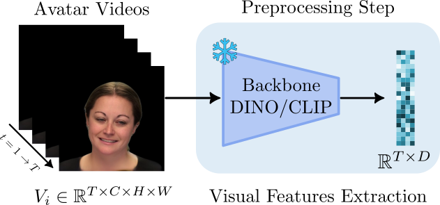

# Foundational Models Feature Extraction



To obtain frame-level visual representations, each video was processed using frozen foundational models as feature extractors. Specifically, we considered CLIP with a ViT-L/14 backbone and DINOv2 with a ViT-L/14 backbone and registers, which provide complementary representations learned from large-scale pre-training. Each video frame was resized to ($224 \times 224$) pixels and normalized according to the preprocessing protocol of the corresponding model. 


The resulting sequence of frames was then independently encoded to obtain a temporal sequence of embeddings, preserving the original frame order. For long videos, feature extraction was performed in smaller temporal batches to reduce memory requirements. The resulting embeddings were stored and subsequently used as input representations for the downstream experiments.


This directory contains the embedding extract code from the proposed benchmark.


## Setting up the environment

```bash
# Create a python environment
conda create -n avatar_fingerprinting python=3.12

# Activate it
conda activate avatar_fingerprinting

# and install the packages from `benchmark/code/requirements.txt`:
pip install -r benchmark/code/requirements.txt

# CUDA version used was 12.8.
```


## Feature extraction configuration

The following arguments configure the extraction of frame-level features from the avatar videos.


```bash
python extract_features.py \
    --input-directory database/data/videos \
    --output-dir database/data/embeddings \
    --file-reference ./database/data/metadata/avaprintdb_metadata.csv \
    --backbone CLIP \
    --generators GAGA LIVE HUNY \
    --split DEV \
    --device cuda:0
```

When running the extractor script, a directory will be generated in `database/data/embeddings/*`, and it will contain:
- Folder with split/generator and all the videos preproccesed.


### Argument details

The following arguments configure the extraction of frame-level features from the avatar videos.

| Argument | Description | Default value |
|---|---|---|
| `-i`, `--input-directory` | Path to the directory containing the avatar videos to preprocess | `database/data/videos` |
| `-o`, `--output-dir` | Path to the directory where the extracted `.pt` feature files will be stored | `database/data/embeddings` |
| `-f`, `--file-reference` | Path to the CSV file containing the dataset metadata | `./database/data/metadata/avaprintdb_metadata.csv` |
| `-b`, `--backbone` | Backbone model used for frame-level feature extraction | `CLIP` or `DINO` |
| `-g`, `--generators` | Avatar generators to include in the extraction process | `GAGA`, `LIVE`, `HUNY` |
| `-s`, `--split` | Dataset split to process | `DEV` or `TEST`|
| `-d`, `--device` | Device used to run the backbone model | `cuda:0` or `cpu` |
||||||
