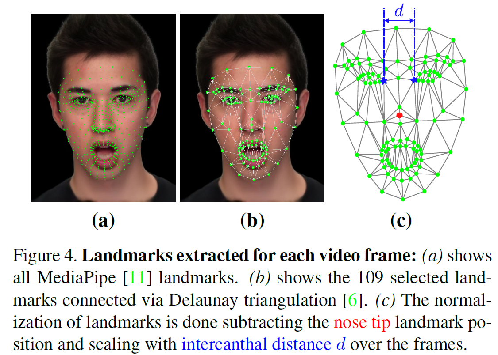

Landmarks Extraction
===

This code generates the 109 landmarks used in https://doi.org/10.1109/IJCB65343.2025.11411089 and 
https://doi.org/10.48550/arXiv.2603.26934.




> [!NOTE]
> The indices of the 109 landmarks selected from the full set of Mediapipe landmarks is specified in the variable `LANDMARK_IDS` in `landmark_extraction.py`

Running the code
---

Create a Python 3.12 environment:

```bash
conda create -n landmarks python=3.12
```

activate it:

```bash
conda activate landmarks
```

and install the packages from `requirements.txt`:
```bash
pip install -r requirements.txt
```


Run `python landmark_extraction.py -h` to see all the options for generating the mediapipe landmarks.


